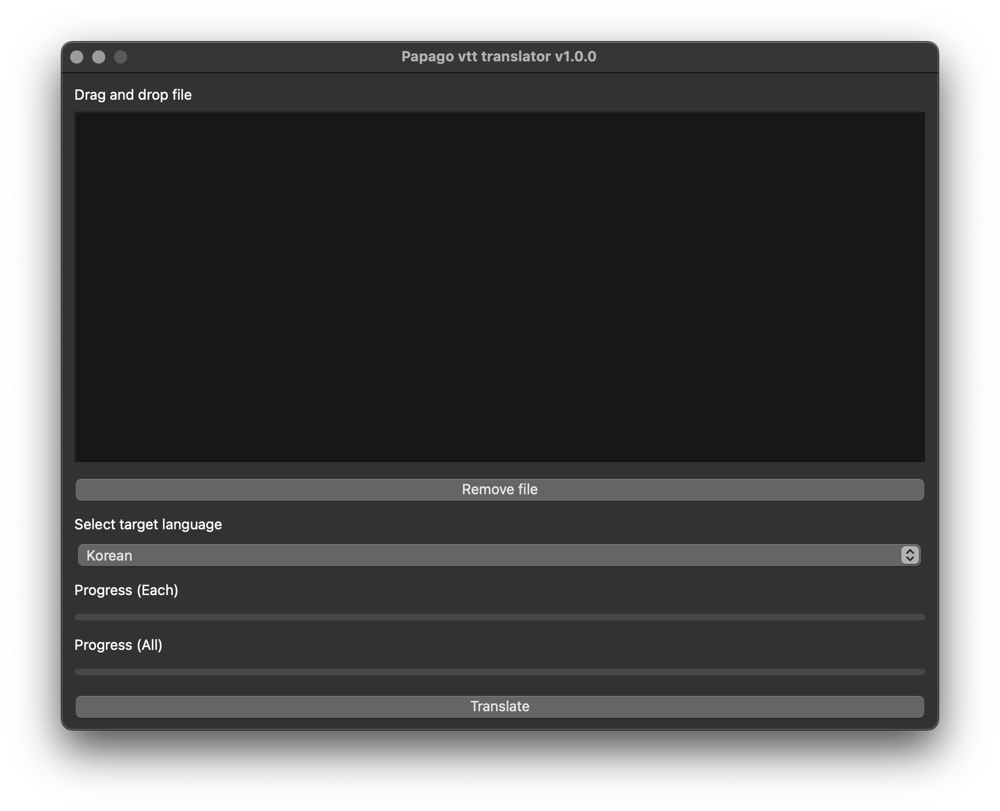

# Papago VTT

## TL;DR

Translate VTT files with [Papago](https://papago.naver.com/).

## Screenshot

## To Use

1. Install requirements (ex: `pip install -r requirements.txt`)
2. Get your own papago API's client id and client secret.
3. Open `papago_vtt.py` and insert your client id, client secret in `api properties for papago`.
4. Run `python3 papago_vtt.py`.

## TODO

- [ ] Add translate option(deeple).
- [ ] Translate with async.
- [ ] Add Progress bar.
- [ ] Prevent freezing GUI while processing.
- [ ] Read api credential information from file.
